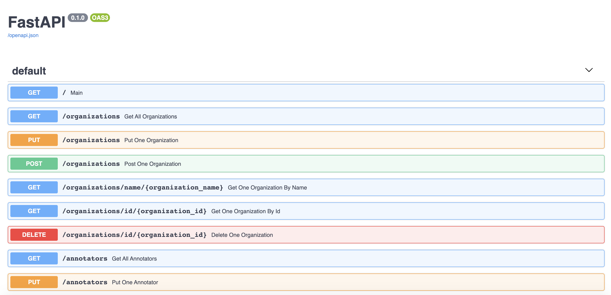

# Fast API template
Lightning Fast API template

# Folder structure
## TODO: Add descriptions

# How to launch API locally
- with Python  
`pip install -r src/requirements.txt` then,  
`uvicorn src.main:app --reload`  
- with docker-compose  
`docker-compose build && docker-compose up -d`

# Swagger Documentation
After launching the API, if you access to `http://0.0.0.0:80`, you should be able to see Swagger documentation.

# How to contribute
## Branch rule
Each pull request should follow the branch naming conventions as follows.
### /feature/{feature_name} (e.g. feature/add_audio_endpoint)
Branch contains new features, additions and optimizations.
### /hotfix/{fix_name} (e.g. hotfix/fix_dataset_unit_test)
Branch contains hotfix for existing features.

# Unit test
## TODO: Add descriptions

# Code coverage test
## TODO: Add descriptions